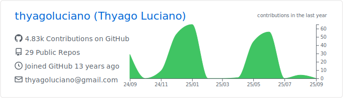

### Hello There, I'm Thyago Luciano!  

- 🔭 I’m currently working on open source projects.
- 🌱 I’m currently learning Flutter,Golang...
- 💬 Ask me about Flutter, JavaScript, Kotlin, Golang or any tech related Stuff.
- 📫 How to reach me: LinkedIn : [@thyagoluciano](https://www.linkedin.com/in/thyagoluciano)
Twitter  : [@thyagoluciano](https://twitter.com/thyagoluciano)

### Analytics ⚙️

<a href="https://github.com/AVS1508">
  
   
  
</a>

